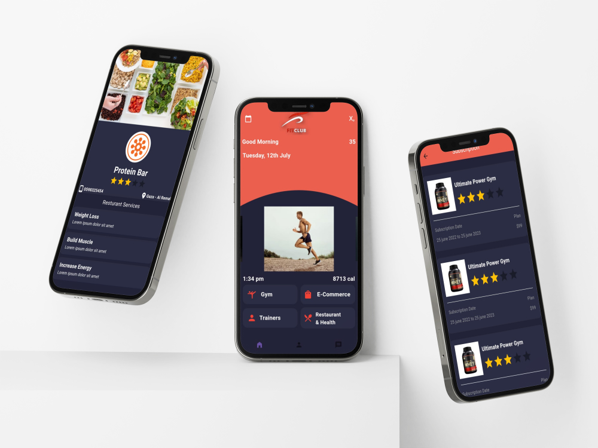
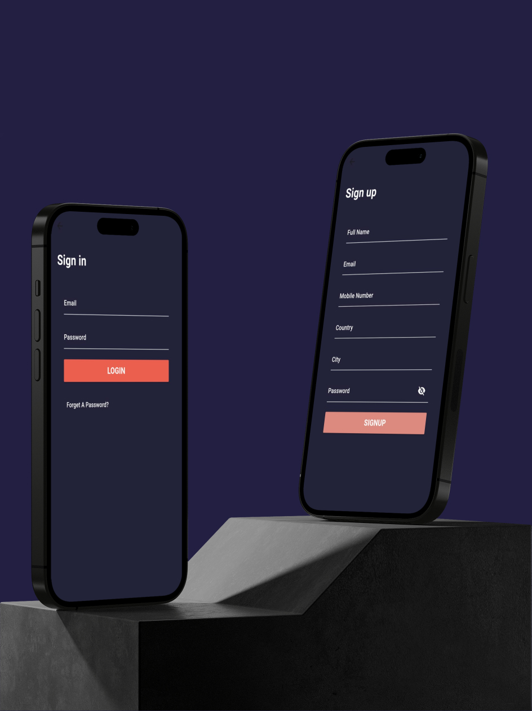
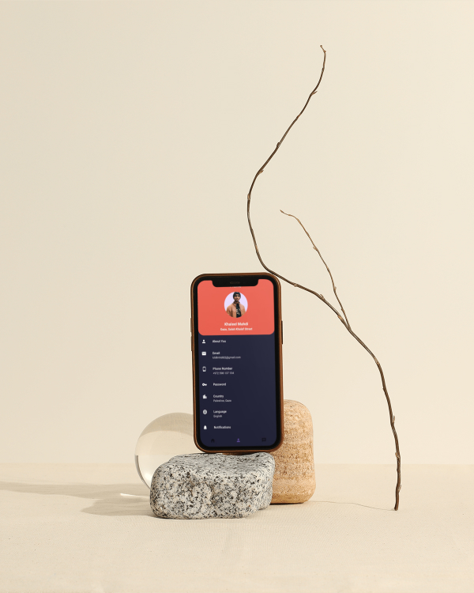

# GYM UI App
## Getting Started
This is a simple UI app GYM system include restaurant, subsuitution, message

## Plugins
- Splash Screen "Custom"
- Google fonts "package"
  flutter_rating_bar "package"
- Carousel slider "package"
- Material3

## How to use this app
- You can install application in your device via this repo
```bash
git clone https://github.com/klilmhdi/gym_ui_app.git
cd gym_ui_app
flutter pub get // install plugins
flutter run
```

Get the view for this screens about my application

<br>

<br>

